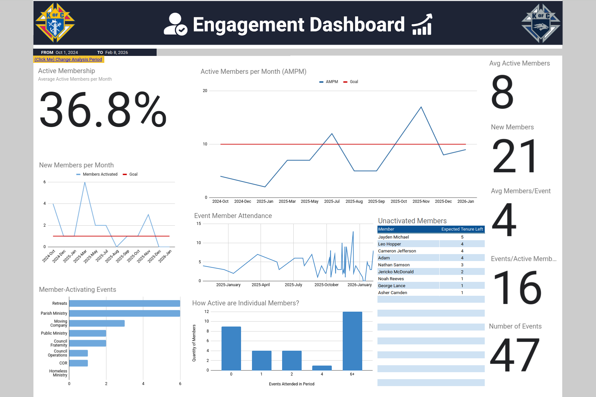
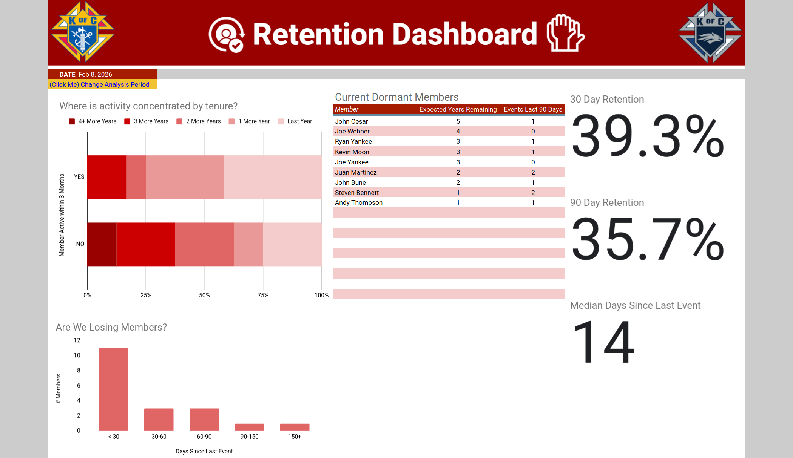
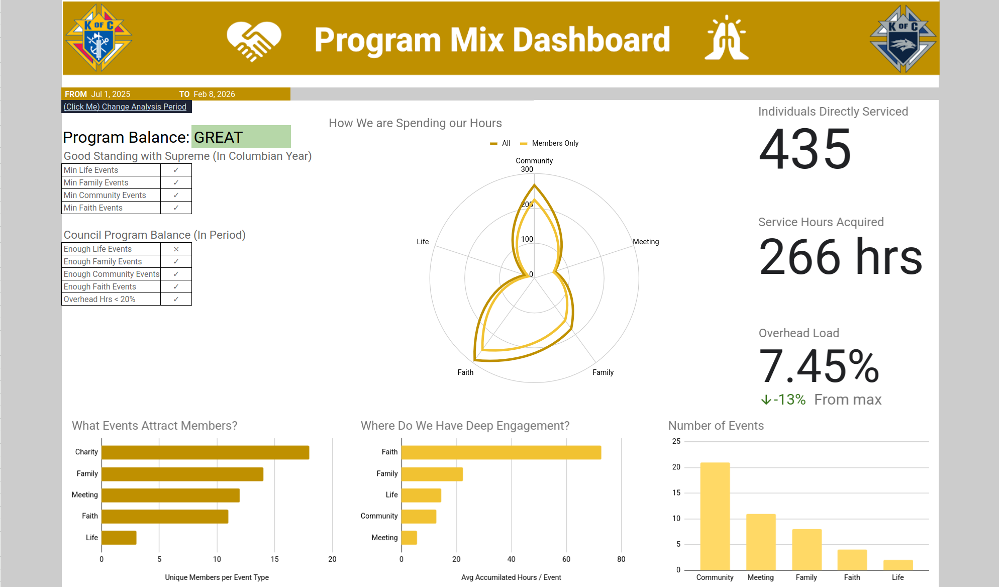

    

# Volunteer Impact and Performance Analysis
### *A data‑driven evaluation of volunteer engagement, event performance, and impact — built to guide smarter planning, stronger participation, and higher‑impact service.*

  </a>
  </a>
  </a>
  </a>

---

## AUTHOR
**Robb Northrup**

Data Analytics | Aerospace | Community Impact

**Date** Jan 23, 2026 - Present

  
  
  

---

## TABLE OF CONTENTS
- [Executive_Summary](#executive-summary)
- [Background](#background)
- [Data_Structure_Overview](#data-structure-overview)
- [Insights_Deep_Dive](#insights-deep-dive)
- [Recommended_Actions](#recommended-actions)

---

## EXECUTIVE SUMMARY
**The Knights of Columbus is a global Catholic fraternal organization dedicated to charity, unity, and community service.**
For over a century, the Knights of Columbus has been one of the world’s largest charitable service organizations—mobilizing millions of volunteer hours annually, distributing tens of millions of dollars in direct aid, and supporting communities through disaster relief. This global impact is dependent on how well local councils engage volunteers, allocate time, and prioritize high‑impact activities.

### Problem Statement
**Council 16207 has no consistent fundraising strategy or performance metrics, limiting its ability to support charitable initiatives despite strong member engagement and volunteer hours.**

By analyzing event participation patterns, volunteer hours, fundraising performance, and engagement distribution across the semester, this project identifies which activities deliver the strongest charitable return per hour invested. The analysis highlights:
1. High‑engagement events that consistently attract volunteers
2. Programs with declining participation that may require redesign or retirement
3. Operational bottlenecks caused by turnover, inconsistent planning, or unclear expectations

Using these insights, I developed a data‑driven planning framework to guide future officers in strengthening participation, continuity, and charitable impact.

### Dashboards

Figure 1. Longterm AMPM, engagement, and activity dashboard

Figure 2. Council continuity and member retention dashboard

Figure 3. Programming evaluation dashboard

### Key Findings
- AMPM rose steadily from **4 -> 9 AMPM** (active members per month) and approaching our goal of 10, from Oct 2024-Jan 2026.
- Participation is bimodal - 11 highly active members vs 10 dormant members, with few members between.
- **75%** of active membership is concentrated in members that are **projected to leave within the next two years**.
- **~92% of our accumulated hours were centered around service and faith development** since the new Colombian Year began (coinciding with new leadership). This challenges members' concerns that too much of our contributed effort goes towards overhead.
- **Charity** events are the council’s strongest lever for **broad engagement** and new member activation.
- Members have the **deepest engagement** with **faith** development events.

**Resources**
- Click here to access the [project dashboards and data](https://docs.google.com/spreadsheets/d/1LQVH9NrwlRhR1RyaSbRnYVoQc2Cqf7UhCpwxnpQ6i5s/edit?usp=sharing).
- Click here to access the [Performance Executive Summary](/Documentation/KofC16207_Executive_Summary.docx).
- Click here to access the [Impact Analysis Slide Deck](/Documentation/KofC16207_Impact_Analysis_Presentation.pptx).

---

## BACKGROUND
Since my membership began in The Knights of Columbus Council 16207, I've noticed a series of persistent challenges that have limited our growth, member retention, and measurable community impact:
- Largely inactive members
- Overemphasis on meetings and administrative activities
- Highly motivated members pursuing projects individually rather than collaboratively
- Difficulty balancing one‑on‑one charitable outreach with broad, measurable impact

These challenges are compounded by the realities of a college council: high turnover, limited continuity, and difficulty maintaining long‑term direction. At the beginning of the 2025–2026 Colombian year, it became clear that we needed:
- Systematic data tracking
- SMART goals
- KPIs aligned with those goals
- Semesterly and yearly performance reviews
- An accessible, easy‑to‑use database for future officers

Data empowers, encourages, and strengthens — and this project aims to bring that clarity to our council.

---

## DATA STRUCTURE OVERVIEW
- What data sources exist
- Why normalization was needed
- What the ERD represents

Figure 4. Entity‑relationship diagram illustrating the structure of the Events, Members, Officers, and Participation tables.

### Event Tracker
This project relies on a Google Sheets workbook tracking:
- Events
- Active members
- Volunteer and fraternal hours
- Event costs and returns
- Impact metrics

The workbook is accessible to all members, with write permissions restricted to officers to preserve data integrity. Google Sheets was chosen for:
1. Minimal technical skill requirements
2. Portability
3. Familiarity among students

---

## INSIGHTS DEEP DIVE
*Analysis conducted Feb 8, 2026*
### 1. Membership Growth
AMPM rose steadily from **4 -> 9 AMPM** (active members per month) and approaching our goal of 10, from Oct 2024-Jan 2026.
- Membership growth is attributed to an increase of council activity and not greater event attendance overall. Members/event averages at 4 for the current Colombian year.
- Sharp declines in active members from Jul-Oct, Dec-Jan 2025 is attributed to membership residing outside of the Reno Metropolitan area during this time.

### 2. Engagement Distribution
Participation is bimodal - 11 highly active members vs 10 dormant members, with few members between.
- This distribution indicates that our council operations **rely heavily on a small, core group**. This makes it difficult to distribute workloads evenly scale operations, and ensure council continuity.
- 10 members attended 0 events and 11 members attended 6+. 9 members fall in between these categories, skewing towards inactive (Aug 2025 - Feb 2026)
- Members average 14 days since last event (median), implying that focusing on entirely inactive members have a greater effect on bolstering our AMPM as opposed to targeting semi-active members.

### 3. Council Continuity
**75%** of active membership is concentrated in members that are **projected to leave within the next two years**.
- If new members are not activated within the next few months, AMPM could drop to 2-3 members. This trajectory places the council at high risk of operational collapse within the next year.
- 42% of active members have a tenure that will end within the year
- 33% of active members have a tenure that will end between 1 and 2 years.

### 4. Low Overhead
**~92% of our accumulated hours were centered around service and faith development** since the new Colombian Year began (coinciding with new leadership). This challenges members' concerns that too much of our contributed effort goes towards overhead.
- This may be a consequence of individuals having to track their hours in the first place and being motivated to contribute more time to these activities.
- One hypothesis is that hour tracking incentivized members to log more service time than before. Tracking hours increases the visibility of efforts, especially those that would typically go unnoticed.
- Further data collection is needed to determine whether this pattern persists across future semesters.

### 5. Engagement Breadth
**Charity** events are the council’s strongest lever for **broad engagement** and new member activation.
- Breadth is critical for activation, recruitment, and maintaining a high AMPM.
- 18 different members attended charity events vs 11 for faith events
- 52% of all members were activated by charitable events (vs. 33% faith and 15% fraternity)
- Most unique members for an event type were centered around charity events (15 members)

### 6. Engagement Depth
Members have the **deepest engagement** with **faith** development events.
- Faith events deepen member commitment, while charity events broaden participation.
- **72.6 average hours accumulated per faith event** vs. (22.3 hours family, 14.5 hours life, 12.7 hours community, and 5.6 meeting)
- 21 charity events vs 4 faith events
- ~250 member hours accumulated for faith events vs ~230 hours for community events

---

## RECOMMENDED ACTIONS
*As of Feb 8, 2026*
### 1. Expand on Service Programming (Breadth Driver)
- Add **1-2 more service events** every month to activate more members and **increase AMPM by 10-15%**.
- Service events accounted for the most member activations and attracted the most unique members.

### 2. Target Dormant and Inactivated Members
- **Activate 1** dormant or inactivated **member per month** through service opportunities.
- Incorporate a **buddy system** to pair officers with a target member.
- Only 25% of our council is comprised of members with a 3-4 year expected tenure. This is devastating for long-term council continuity.
- Targeting these members would not only ensure the continuity of our council into the coming 2-3 years, but also give greater experience to the future leaders of our organization, and ensure the strength of our order longterm.

### 3. Continuity Planning
- Target inactive members (see above) to mitigate the projected **2-year membership cliff**.
- Reintroduce the "**Knights of the Round Table**" training where new members and officers are properly on-boarded on their duties and given a path to success in their role.

### 4. Programming for Breadth + Depth
- Maintain a **3:1 charity to faith event ratio** to help foster active council commitment and achieve **45% 30-day retention**.